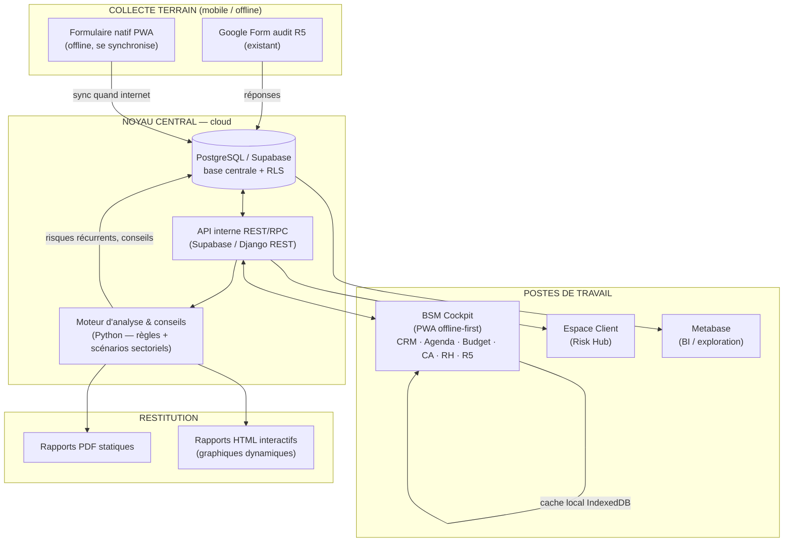

# Architecture du système interne BSM Advisory & Consulting
### Système modulaire, interconnecté, offline-first — gouvernance des risques (méthode R5)

**Auteur : préparé pour Jean-Baptiste Barthe / BSM A&C — Antananarivo, Madagascar**
**Objet : réponse au cahier d'architecture — unifie les 3 briques existantes en un seul système.**

---

## 0. Point de départ : trois briques déjà en place

Tu possèdes déjà trois éléments qui doivent **converger**, pas se dupliquer :

| Brique existante | Nature | Rôle dans la cible |
|---|---|---|
| **Google Form + Sheets R5** (`BSM_R5_Matrice`) | Collecte terrain + moteur de calcul (9 onglets) | **Source de la méthode** : questionnaire d'audit, calcul score P×I, cartographie, recommandations |
| **BSM Risk Hub** (package Next.js + Supabase) | Spec produit *client* (SaaS cloisonné) | **Base de données centrale** (PostgreSQL/Supabase) + espace client |
| **BSM Cockpit** (app locale HTML) | Outil *interne* de pilotage | **Poste de travail offline-first** du consultant (CRM, agenda, budget, CA, RH, R5) |

> L'objectif de cette architecture : **une seule base de données** (PostgreSQL), alimentée par les formulaires terrain, exploitée par un **cockpit interne offline-first** et un **espace client**, avec un **moteur d'analyse/conseils** au centre. Le Google Sheet actuel devient soit la référence importée, soit progressivement retiré au profit de la base.

---

## 1. Architecture technique cible



**Principe directeur : « offline-first, cloud-synced ».** Chaque poste travaille sur un cache local (fonctionne sans internet, contrainte Madagascar) et se synchronise avec la base centrale dès que la connexion revient. Aucune opération critique ne dépend d'une connexion permanente.

---

## 2. Choix technologiques (open-source privilégié)

| Couche | Recommandation | Pourquoi (contexte BSM / Madagascar) |
|---|---|---|
| **Base de données** | **PostgreSQL** (via **Supabase**, auto-hébergeable) | Open-source, robuste, RLS de sécurité par ligne. Supabase = Postgres + Auth + API REST auto + Storage, sans écrire de serveur. |
| **Backend / API** | Supabase (par défaut) **ou** Django REST / FastAPI | Supabase évite de maintenir un serveur. Django/FastAPI si logique métier lourde en Python. |
| **Moteur d'analyse** | **Python** (pandas, scikit-learn en option) | Détection de risques récurrents, scoring, génération de conseils. Exécuté en tâche planifiée ou API route. |
| **Cockpit interne** | **PWA** (HTML/JS, évolution du Cockpit actuel) + IndexedDB | Installable sur PC/mobile, **fonctionne offline**, se synchronise. Zéro coût de licence. |
| **BI / dashboards** | **Metabase** (open-source) sur la base Postgres | Exploration libre des données par la direction, sans coder. Alternative : Power BI si licence déjà présente. |
| **Reporting PDF** | Python **WeasyPrint** (HTML→PDF) ou `@react-pdf/renderer` | WeasyPrint : on écrit le rapport en HTML/CSS, il produit un PDF fidèle. |
| **Reporting HTML interactif** | **Chart.js / Plotly** dans un HTML autonome | Graphiques dynamiques, exportable, ouvrable hors-ligne. |
| **Hébergement** | Supabase Cloud + Vercel (ou VPS local + Docker) | Hybride : cloud pour la synchro, possibilité d'un serveur local au bureau d'Ivato. |
| **Sécurité** | RLS Postgres, JWT, HTTPS, sauvegardes chiffrées | Cloisonnement par rôle et par organisation (déjà spécifié dans Risk Hub). |

---

## 3. Modules & interconnexions

| Module | Contenu | Alimenté par | Produit / consommé par |
|---|---|---|---|
| **1. CRM interne** | Clients, prospects, interlocuteurs, statut, secteur | Saisie + import R5 « CLIENTS » | Missions, Facturation, Analyse |
| **2. Missions R5** | Contrat, phase R5, montant HT, acompte, solde, livrables | Saisie + import « MISSIONS » | CA, Reporting, Suivi |
| **3. Collecte audit** | Réponses du Form R5 (terrain) | Google Form / PWA offline | Matrice des risques |
| **4. Matrice des risques** | Famille, catégorie, description, P, I, score, niveau, mesures | Collecte audit + saisie | Cartographie, Moteur de conseils |
| **5. Cartographie** | Heatmap P×I, répartition par famille | Matrice (auto) | Direction, Reporting |
| **6. Moteur d'analyse & conseils** | Détection risques récurrents, scénarios sectoriels | Matrice + historique | Recommandations, Alertes |
| **7. Recommandations** | Plan d'action, horizon, priorité, budget, indicateur | Moteur + saisie | Suivi & traitement, Reporting |
| **8. Suivi & traitement** | Avancement %, statut, jours restants | Recommandations | Tableau de bord |
| **9. Finance** | Budget (entrant/sortant), CA provisoire/effectif, modes de paiement | Saisie (Cockpit actuel) | Tableau de bord, Reporting |
| **10. RH** | Personnel, recrutement, congés, activités, secteurs, permissions, affectation missions | Saisie | Missions (affectation), Pilotage |
| **11. Reporting** | PDF statiques + HTML interactifs | Tous les modules | Client, Direction, Board |

**Interconnexions clés** (la valeur est dans les liens, pas les silos) :
- `Client → Missions → Risques → Recommandations → Suivi` = la chaîne R5 complète, traçable de bout en bout.
- `Risques (tous clients) → Moteur → tendances sectorielles` = intelligence inter-clients (benchmark).
- `RH (affectation) → Missions (charge) → Pilotage` = qui fait quoi, disponibilité.
- `Finance ↔ Missions` = CA rattaché à chaque mission (acompte/solde).

---

## 4. Algorithmes proposés

### 4.1 Scoring d'un risque (déjà dans ta matrice, formalisé)
```
score = probabilité (1..5) × impact (1..5)          → 1..25
niveau = CRITIQUE si score ≥ 15
         HAUTE    si 9 ≤ score ≤ 14
         MOYENNE  si 4 ≤ score ≤ 8
         FAIBLE   si score ≤ 3
```

### 4.2 Détection des risques récurrents (le module clé)
Objectif : repérer, à travers **tous les audits**, les risques qui reviennent — par **secteur**, **famille** et **catégorie** — pour nourrir la veille et la prospection.

Logique :
1. Regrouper tous les risques par `(secteur, famille, catégorie)`.
2. Compter la fréquence, la proportion de clients touchés, le score moyen.
3. Marquer « récurrent » si présent chez ≥ N clients **ou** ≥ X % des clients d'un secteur.
4. Prioriser par `fréquence × score moyen` (un risque fréquent ET grave remonte en tête).

### 4.3 Génération de conseils (moteur de règles + scénarios sectoriels)
- **Table de scénarios** par secteur (énergie, agriculture, TIC, mines, BTP, distribution…) : chaque `(secteur, catégorie de risque)` → un conseil-type paramétrable, **éditable manuellement**.
- **Règles génériques** : retard de traitement, risque critique sans mesure, actif critique sans secours, dépendance fournisseur unique, etc.
- Sortie = recommandations pré-rédigées, **toujours modifiables** par le consultant avant envoi (l'IA/le moteur propose, l'humain valide).

---

## 5. Exemple de code Python — détection des risques récurrents + conseils

```python
from collections import defaultdict
from dataclasses import dataclass

# --- Modèle d'un risque issu d'un audit ---
@dataclass
class Risque:
    client_id: str
    secteur: str          # ex. "Énergie", "BTP", "Distribution"
    famille: str          # ex. "Opérationnel", "IT", "Logistique"
    categorie: str        # ex. "Cyberattaque", "Fournisseur unique"
    probabilite: int      # 1..5
    impact: int           # 1..5

    @property
    def score(self) -> int:
        return self.probabilite * self.impact

    @property
    def niveau(self) -> str:
        s = self.score
        return ("CRITIQUE" if s >= 15 else "HAUTE" if s >= 9
                else "MOYENNE" if s >= 4 else "FAIBLE")

# --- Table de conseils sectoriels (éditable par BSM) ---
CONSEILS_SECTORIELS = {
    ("Énergie", "Dépendance réseau"):
        "Installer une solution d'autoproduction/secours (solaire + générateur) "
        "et un plan de délestage priorisé.",
    ("Distribution", "Fournisseur unique"):
        "Qualifier au moins un fournisseur alternatif et contractualiser un "
        "stock de sécurité sur les références critiques.",
    ("TIC", "Cyberattaque"):
        "Déployer sauvegardes hors-ligne (règle 3-2-1), MFA et un plan de "
        "réponse à incident testé.",
    # ... complété par BSM, secteur par secteur
}
CONSEIL_PAR_DEFAUT = "Formaliser une mesure de maîtrise et désigner un responsable avec échéance."

def detecter_risques_recurrents(risques, seuil_clients=2, seuil_ratio=0.30):
    """Regroupe les risques et identifie les récurrences par secteur/catégorie."""
    groupes = defaultdict(list)
    clients_par_secteur = defaultdict(set)

    for r in risques:
        groupes[(r.secteur, r.famille, r.categorie)].append(r)
        clients_par_secteur[r.secteur].add(r.client_id)

    resultats = []
    for (secteur, famille, categorie), items in groupes.items():
        clients_touches = {r.client_id for r in items}
        nb_clients_secteur = max(1, len(clients_par_secteur[secteur]))
        ratio = len(clients_touches) / nb_clients_secteur
        score_moyen = sum(r.score for r in items) / len(items)

        recurrent = len(clients_touches) >= seuil_clients or ratio >= seuil_ratio
        if not recurrent:
            continue

        conseil = CONSEILS_SECTORIELS.get((secteur, categorie), CONSEIL_PAR_DEFAUT)
        resultats.append({
            "secteur": secteur, "famille": famille, "categorie": categorie,
            "nb_occurrences": len(items),
            "clients_touches": len(clients_touches),
            "ratio_secteur": round(ratio, 2),
            "score_moyen": round(score_moyen, 1),
            "priorite": round(len(items) * score_moyen, 1),  # fréquence × gravité
            "conseil_propose": conseil,   # éditable avant validation
        })

    # les plus fréquents ET les plus graves d'abord
    return sorted(resultats, key=lambda x: x["priorite"], reverse=True)

# --- Exemple ---
if __name__ == "__main__":
    audits = [
        Risque("BSM-000", "BTP", "IT", "Cyberattaque", 3, 4),
        Risque("BSM-001", "Distribution", "Logistique", "Fournisseur unique", 4, 4),
        Risque("BSM-002", "Distribution", "Logistique", "Fournisseur unique", 3, 5),
        Risque("BSM-003", "Énergie", "Opérationnel", "Dépendance réseau", 4, 4),
    ]
    for r in detecter_risques_recurrents(audits, seuil_clients=2):
        print(f"[{r['priorite']}] {r['secteur']} / {r['categorie']} — "
              f"{r['clients_touches']} clients, score moyen {r['score_moyen']} → {r['conseil_propose']}")
```

> Ce même algorithme tourne **déjà en version « règles »** dans le Cockpit actuel (onglet Analyses). La version Python ci-dessus est l'évolution serveur, capable d'analyser **tout le portefeuille** et d'alimenter la veille sectorielle.

---

## 6. Automatisation des rapports

### 6.1 PDF statique (rapport de mission, livrable client)
1. Le moteur assemble les données de la mission (client, risques, cartographie, recommandations, scores).
2. Un **template HTML/CSS** (charte BSM navy/cream/gold) est rempli.
3. **WeasyPrint** (Python) convertit ce HTML en PDF fidèle → archivé + envoyé au client.
```python
from weasyprint import HTML
HTML(string=html_rapport).write_pdf("Rapport_BSM_<client>_<date>.pdf")
```

### 6.2 HTML interactif (tableau de bord vivant)
- Page HTML autonome avec **Chart.js/Plotly** : heatmap des risques, tendances de score, avancement des actions.
- **Fonctionne hors-ligne** (données injectées dans le fichier) — idéal pour présenter chez un client sans internet.
- Réutilise directement les composants déjà écrits dans le Cockpit.

---

## 7. Réponse aux contraintes Madagascar

| Contrainte | Réponse d'architecture |
|---|---|
| **Connexion instable** | Offline-first : cache local (IndexedDB), synchronisation différée. Aucune saisie perdue si coupure. |
| **Mobilité terrain** | Formulaire d'audit en PWA installable sur smartphone, remplissable hors-ligne, synchronisé au retour du réseau. |
| **Coûts** | Stack 100 % open-source (Postgres, Python, Metabase, PWA). Pas de licence obligatoire. |
| **Faible bande passante** | Synchronisation par deltas (seulement les changements), rapports HTML légers. |
| **Autonomie** | Option serveur local (Docker au bureau d'Ivato) + miroir cloud. |

---

## 8. Sécurité

- **RLS PostgreSQL** : chaque rôle (bsm_admin, bsm_consultant, client_dg, client_user) ne voit que ce qui le concerne (déjà spécifié dans Risk Hub).
- **Authentification JWT** (rôle + org_id), HTTPS partout.
- **Sauvegardes automatiques chiffrées** (quotidiennes) + export manuel.
- **Journalisation** des actions sensibles (suppression, modification de score).
- **Clé de service** (bypass RLS) jamais exposée au navigateur.

---

## 9. Feuille de route pragmatique

| Étape | Contenu | Dépendance |
|---|---|---|
| **Phase 1 — Cockpit local enrichi** *(en cours)* | RH, modules R5 (missions, matrice, cartographie, recommandations), import du Sheet R5, lien Form d'audit | Aucune — fichier local |
| **Phase 2 — Base centrale** | Migration des données Cockpit → PostgreSQL/Supabase, API, RLS | Comptes Supabase |
| **Phase 3 — PWA offline-sync** | Le Cockpit devient installable + se synchronise à la base | Phase 2 |
| **Phase 4 — Moteur Python + BI** | Détection risques récurrents portefeuille, Metabase, rapports auto | Phase 2 |
| **Phase 5 — Espace client** | Risk Hub branché sur la même base | Phase 2 |

---

## 10. Recommandation de synthèse

Pour un cabinet solo/à petite équipe en contexte malgache, je recommande :
1. **Court terme** : muscler le **Cockpit local** (RH + R5 + import Sheet + lien Form) → valeur immédiate, zéro dépendance, zéro coût.
2. **Moyen terme** : basculer la base sur **Supabase/PostgreSQL** (open-source, Postgres) et transformer le Cockpit en **PWA offline-sync** — c'est le meilleur compromis puissance / robustesse / coût pour Madagascar.
3. **Éviter** un backend Django lourd tant que l'équipe est réduite : Supabase couvre 90 % du besoin sans serveur à maintenir. Django/FastAPI seulement quand le moteur d'analyse Python devient central.

*Document d'architecture — à faire évoluer avec les décisions de JB.*
